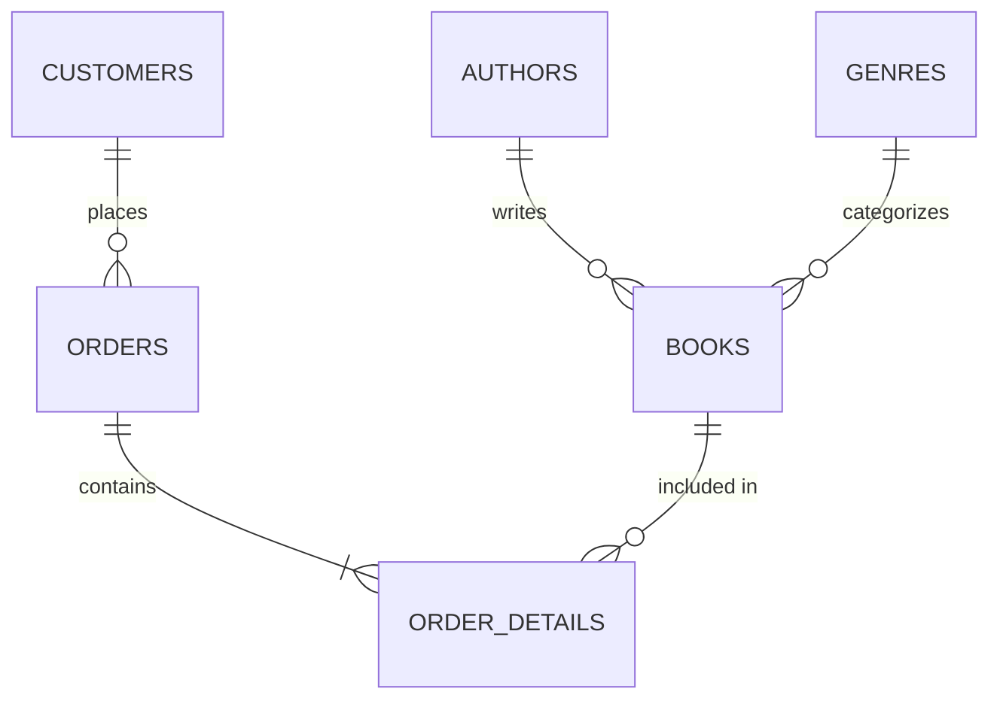

# Bookstore Relational Database Project

A comprehensive MySQL database design and analysis project for an independent bookstore. This repository showcases relational database design, entity relationship mapping, and advanced SQL querying (ranging from basic filtering to complex subqueries and multi-table joins).

## 1. Database Architecture & ER Diagram

The database consists of 6 tables optimized to reduce redundancy and maintain data integrity through explicit Primary and Foreign Key constraints.

### ER Diagram



## 2. Schema Blueprint

- **Core Entities:** `Authors`, `Genres`, `Customers`, `Books`
- **Transactional Entities:** `Orders`, `Order_Details` (Junction table resolving the Many-to-Many relationship between Books and Orders).

---

## 3. Case Studies & Advanced Queries

### 🟢 Easy: Data Filtering & Operational Metrics

#### Q1: Targeting Specific Customer Demographics

- **Business Problem:** Identify active Gmail users living in the major tech hubs of Mumbai or Delhi for an upcoming email marketing campaign.

```sql
SELECT name, email, city
FROM Customers
WHERE email LIKE '%@gmail.com'
    AND city IN ('Mumbai', 'Delhi');
```

**Output:**
| name | email | city |
|----------------|--------------------|--------|
| Aarav Sharma | aarav@gmail.com | Mumbai |
| Ananya Gupta | ananya.g@gmail.com | Delhi |

#### Q2: Inventory Value Calculation

- **Business Problem:** Find books where the total potential revenue of the current stock is between ₹10,000 and ₹25,000.

```sql
SELECT title, (price * stock_quantity) AS total_inventory_value
FROM Books
WHERE (price * stock_quantity) BETWEEN 10000 AND 25000;
```

**Output:**
| title | total_inventory_value |
|---------------------------|-----------------------|
| Five Point Someone | 12500.00 |
| 2 States | 12000.00 |
| Malgudi Days | 20000.00 |
| The Immortals of Meluha | 23940.00 |

#### Q3: Complex Pricing and Stock Filters

- **Business Problem:** Locate specific inventory items that either cost less than ₹300 or have exactly 60 units in stock, while explicitly excluding the book with ID 1.

```sql
SELECT title, price, stock_quantity
FROM Books
WHERE (price < 300 OR stock_quantity = 60)
    AND book_id != 1;
```

**Output:**
| title | price | stock_quantity |
|---------------------------|--------|----------------|
| Malgudi Days | 200.00 | 100 |
| The Immortals of Meluha | 399.00 | 60 |

#### Q4: Post-Q1 Customer Acquisition

- **Business Problem:** Find all customers who joined the bookstore after the first quarter of 2023.

```sql
SELECT name, join_date
FROM Customers
WHERE join_date > '2023-03-31';
```

**Output:**
| name | join_date |
|---------------|------------|
| Ananya Gupta | 2023-04-05 |

---

### 🟡 Medium: Aggregations & Performance Insights

#### Q5: Identifying High-Volume Inventory Items

- **Business Problem:** Calculate the total quantity of each book sold, but only display books that have sold more than 1 unit in total across all orders.

```sql
SELECT book_id, SUM(quantity_ordered) AS total_sold
FROM Order_Details
GROUP BY book_id
HAVING SUM(quantity_ordered) > 1;
```

**Output:**
| book_id | total_sold |
|---------|------------|
| 4 | 2 |

#### Q6: Author Pricing Spread

- **Business Problem:** Find the highest and lowest priced books for each author, sorting the results to show the author with the most expensive book first.

```sql
SELECT author_id, MAX(price) AS highest_price, MIN(price) AS lowest_price
FROM Books
GROUP BY author_id
ORDER BY highest_price DESC;
```

**Output:**
| author_id | highest_price | lowest_price |
|-----------|---------------|--------------|
| 2 | 450.00 | 450.00 |
| 4 | 399.00 | 399.00 |
| 1 | 300.00 | 250.00 |
| 3 | 200.00 | 200.00 |

#### Q7: Customer Purchase Frequency

- **Business Problem:** Count the number of unique days each customer placed an order to distinguish between one-time bulk buyers and frequent returning shoppers.

```sql
SELECT customer_id, COUNT(DISTINCT order_date) AS unique_order_days
FROM Orders
GROUP BY customer_id
ORDER BY unique_order_days DESC;
```

**Output:**
| customer_id | unique_order_days |
|-------------|-------------------|
| 1 | 2 |
| 2 | 1 |
| 3 | 1 |

#### Q8: Average Price per Genre

- **Business Problem:** Calculate the average price of books within each genre to determine which category holds the highest premium.

```sql
SELECT genre_id, AVG(price) AS average_book_price
FROM Books
GROUP BY genre_id
ORDER BY average_book_price DESC;
```

**Output:**
| genre_id | average_book_price |
|-----------|-------------------|
| 2 | 399.000000 |
| 1 | 300.000000 |
| 4 | 300.000000 |

---

### 🔴 Hard: Advanced Analytics & Business Intelligence

#### Q9: Zero-Sales Author Detection

- **Business Problem:** Identify the names of authors who currently have zero historical sales (none of their books have ever been ordered) using an Anti-Join pattern.

```sql
SELECT author_name
FROM Authors
WHERE author_id NOT IN (
    SELECT DISTINCT b.author_id
    FROM Books b
    JOIN Order_Details od ON b.book_id = od.book_id
);
```

**Output:**
| author_name |
|-------------|
| No records found |

#### Q10: Top-Performing Genre Analytics

- **Business Problem:** Identify book genres that are generating revenue higher than the average revenue across all genres to optimize marketing spend.

```sql
SELECT g.genre_name, SUM(od.quantity_ordered * od.price_at_time_of_order) AS genre_revenue
FROM Genres g
JOIN Books b ON g.genre_id = b.genre_id
JOIN Order_Details od ON b.book_id = od.book_id
GROUP BY g.genre_name
HAVING SUM(od.quantity_ordered * od.price_at_time_of_order) > (
    SELECT AVG(total_rev) FROM (
        SELECT SUM(od2.quantity_ordered * od2.price_at_time_of_order) AS total_rev
        FROM Books b2
        JOIN Order_Details od2 ON b2.book_id = od2.book_id
        GROUP BY b2.genre_id
    ) AS avg_revenue
);
```

**Output:**
| genre_name | genre_revenue |
|------------|---------------|
| Fiction | 1100.00 |

#### Q11: Customer Churn Analysis

- **Business Problem:** Find the names of customers who placed an order in May 2023 but did NOT return to place any orders in June 2023.

```sql
SELECT DISTINCT c.name
FROM Customers c
JOIN Orders o ON c.customer_id = o.customer_id
WHERE MONTH(o.order_date) = 5 AND YEAR(o.order_date) = 2023
   AND c.customer_id NOT IN (
       SELECT customer_id
       FROM Orders
       WHERE MONTH(order_date) = 6 AND YEAR(order_date) = 2023
);
```

**Output:**
| name |
|---------------|
| Aarav Sharma |
| Diya Patel |

#### Q12: Largest Order Line-Item Breakdown

- **Business Problem:** Retrieve the human-readable line items (Order ID, Book Title, and Quantity) specifically for the single historical order that contained the highest total volume of books.

```sql
SELECT od.order_id, b.title, od.quantity_ordered
FROM Order_Details od
JOIN Books b ON od.book_id = b.book_id
WHERE od.order_id = (
    SELECT order_id
    FROM Order_Details
    GROUP BY order_id
    ORDER BY SUM(quantity_ordered) DESC
    LIMIT 1
);
```

**Output:**
| order_id | title | quantity_ordered |
|----------|----------------------|------------------|
| 1 | Five Point Someone | 1 |
| 1 | Malgudi Days | 2 |

---

## 🛠️ How to Run Locally

To explore this database on your local machine, follow these steps:

1. **Clone the repository:**
   ```bash
   git clone https://github.com/LaxmanRoy14/bookstore-db-project.git
   cd bookstore-db-project/database
   ```
2. **Launch MySQL CLI or MySQL Workbench:**
   Log in to your local MySQL server as a user with database creation privileges.

```bash
   mysql -u root -p
```

3. **Execute the initial setup script:**
   Source the SQL file to automatically create the database, build the tables, and insert the seed data.
   ```sql
   SOURCE 01_init_db.sql;
   ```
